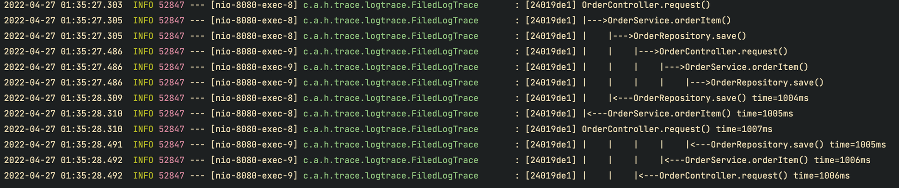
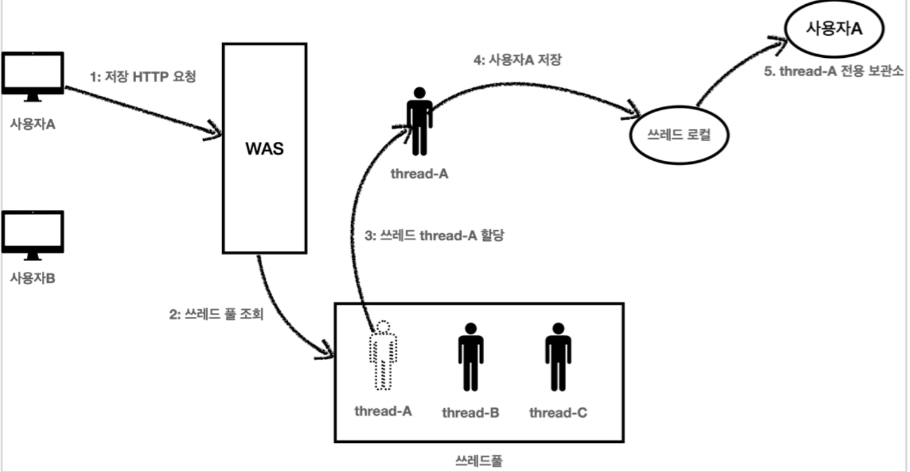
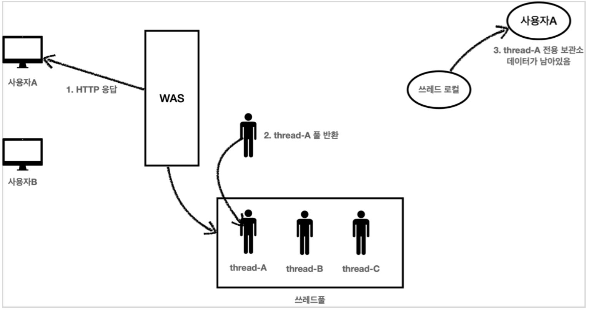
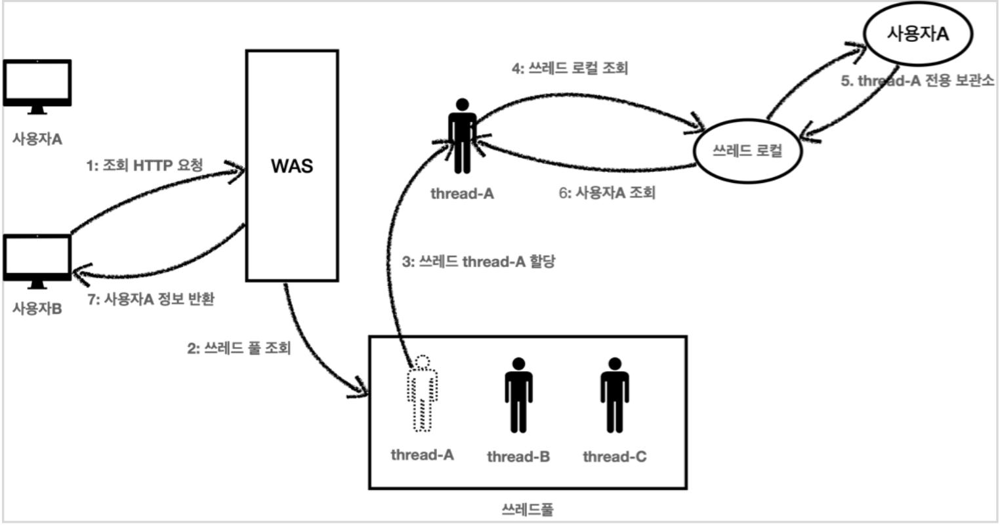
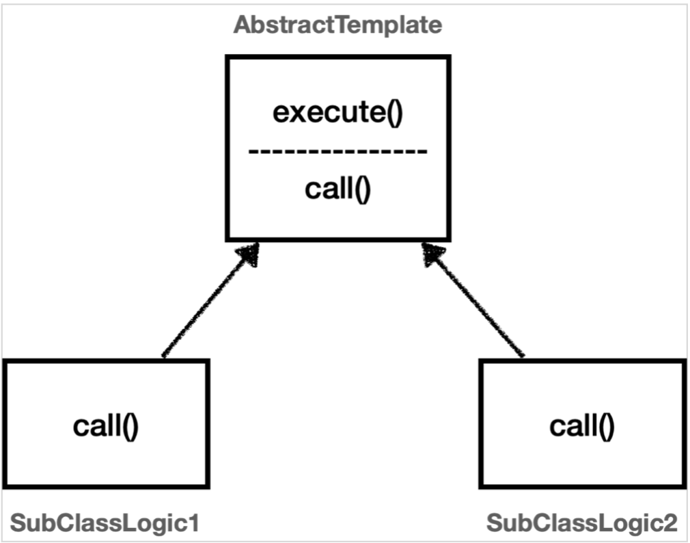
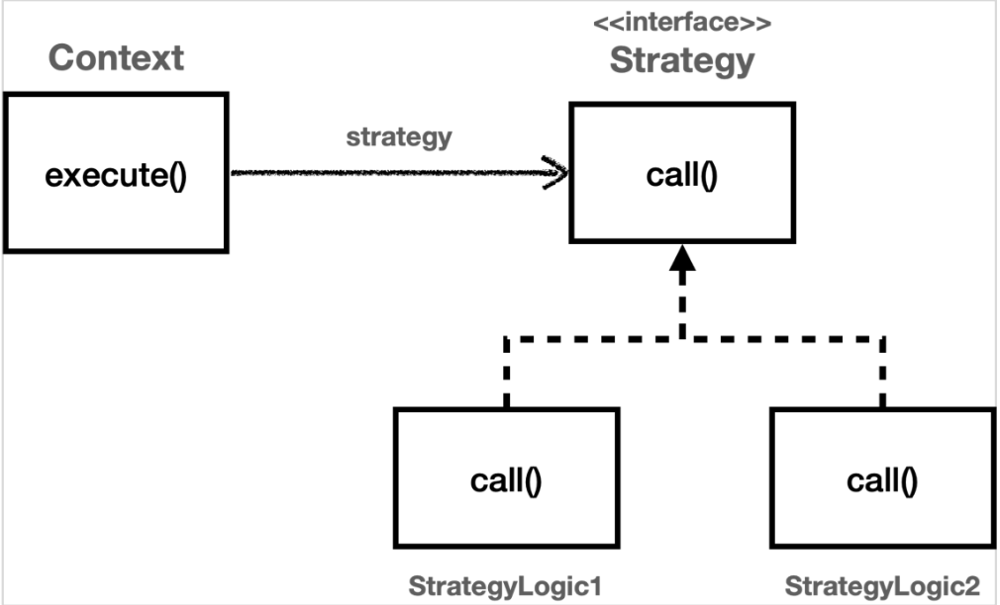

# Spring Boot 활용하기 (디자인 패턴 이해)

## 로그 추적기

### 스프링 빈에 로그 추적기 등록하여 사용하기 - SingleTone 패턴 이해

- Bean으로 등록하여 로그추적기가 필요한 시점에 DI하여 사용함으로 파라미터를 넘기는 방식을 해결한다.

- 다양한 구현제로 변경할 수 있도록 LogTrace 인터페이스를 먼저 생성

	```java
	public interface LogTrace {
	
	    TraceStatus begin(String message);
	
	    void end(TraceStatus status);
	
	    void exception(TraceStatus status, Exception e);
	
	}
	```

- 파라미터를 넘기지 않고 TraceId 를 동기화 할 수 있는 FieldLogTrace 구현체

	- 객채내에서 TraceId를 저장하기 위한 필드 사용 

		```
		private TraceId traceIdHolder;
		```

		- 파라미터 전달방식 문제 해결
		- TraceId 동기화

	```java
	@Slf4j
	public class FiledLogTrace implements LogTrace {
	
	    private TraceId traceIdHolder;//TraceId동기화,동시성 이슈 발생
	
			@Override
	    public TraceStatus begin(String message) {
	        syncTraceId();
	        TraceId traceId = traceIdHolder;
	        Long startTimeMs = System.currentTimeMillis();
	        log.info("[{}] {}{}", traceId.getId(), addSpace(START_PREFIX,
	                traceId.getLevel()), message);
	        return new TraceStatus(traceId, startTimeMs, message);
	    }
	
	    @Override
	    public void end(TraceStatus status) {
	        complete(status, null);
	    }
	
	    @Override
	    public void exception(TraceStatus status, Exception e) {
	        complete(status, e);
	    }
	
		 ...
		 ...
	
	    private void syncTraceId(){
	        if (traceIdHolder == null){
	            traceIdHolder = new TraceId();
	        } else{
	            traceIdHolder = traceIdHolder.createNextId();
	        }
	    }
	
	    private void releaseTraceId() {
	        if (traceIdHolder.isFisrtLevel()){
	            traceIdHolder = null;
	        } else{
	            traceIdHolder = traceIdHolder.createPrevId();
	        }
	    }
	}
	```

- Configuration 클래스 생성 및 Bean 등록

	```java
	@Configuration
	public class LogTraceConfig {
	
	    @Bean
	    public LogTrace logTrace(){
	        return new FiledLogTrace();
	    }
	}
	```

> ‼️해당 로그추적기를 애플리케이션에  진행시 정상적으로 동작하는것으로 보일 수 있으나, 짧은 시간내에 여러본 요청을 할 시 **동시성 문제**가 발생하는것을 알 수 있다



> ❓FieldLogTrace 는 SingleTone으로 등록된 스프링 빈이다. 이 객체의 인스턴스가 애플리케이션에 딱 하나 존재한다는 뜻이다. 이렇게 하나만 있는 인스턴스의 FieldLogTrace.traceIdHolder 필드를 여러 쓰레드가 동시에 접근하기 때문에 문제가 발생한다.

> **참고** 이런 동시성 문제는 지역 변수에서는 발생하지 않는다. 지역 변수는 쓰레드마다 각각 다른 메모리 영역이 할당된다.
>
> 동시성 문제가 발생하는 곳은 같은 인스턴스의 필드(주로 싱글톤에서 자주 발생), 또는 static 같은 공용 필드에 접근할 때 발생한다.
>
> 동시성 문제는 값을 읽기만 하면 발생하지 않는다. 어디선가 값을 변경하기 때문에 발생한다.

### 쓰레드 로컬(Thread Local)

- 쓰레드 로컬은 해당 쓰레드만 접근할 수 있는 특별한 저장소를 말한다.

- 쓰레드 로컬을 사용하면 각 쓰레드마다 별도의 내부 저장소를 제공한다. 따라서 같은 인스턴스의 쓰레드로컬 필드에 접근해도 문제 없다.

- 자바는 언어차원에서 쓰레드 로컬을 지원하기 위한 java.lang.ThreadLocal 클래스를 제공한다.

- ThreadLocal 사용법

	- 제네릭 타입 설정후 생성

	- 값 저장 : `ThreadLocal.set(xxx)`

	- 값 조회 : `ThreadLocal.get()`

	- 값 제거 : `TreadLocal.remove()`

		> ‼️**주의**  해당 쓰레드가 쓰레드 로컬을 모두 사용하고 나면 ThreadLocal.remove() 를 호출해서 쓰레드 로컬에 저장된 값을 제거해주어야 한다
		>
		> - 톰캣은 쓰레드풀을 사용하기 때문에 쓰레드가 사용되고 난 후 쓰레드풀에 그대로 반환된다.
		>
		> - 이 때 쓰레드 로컬에서 이미 사용된 데이터를 제거하지 않으면 같은 반환된 쓰레드가 다시 조회되어 실행될 때 이전에 사용된 데이터가 노출될 수 있다.
		> - 스프링 에서 이러한 문제를 해결하기 위해서는 필터나 인터셉터에서 값을 제거하는 과정을 추가해 주어야 한다.

		

		

		

### 변하는 코드와 변하지 않는 코드 - Template Method 패턴 이해

로그 추적기를 위해 추가되는 코드로 인해 핵심 기능을 위한 코드보다 로그 출력을 위한 부가적인 코드가 훨씬 더 많아지고 복잡해지게됨

목적은  로그를 남기는 부분에 단일책임 원칙(SRP)를 지키도록 하는 것, 변경지점을 하나로 모아서 변경에 쉽게 대처할 수 있는 구조를 만들 것 이다.

- 핵심기능

	```java
	public class OrderControllerV0 {
	    private final OrderServiceV0 orderService;
	
	    @GetMapping("/v0/request")
	    public String request(String itemId){
	        orderService.orderItem(itemId);
	        return "ok";
	    }
	}
	```

- 부가기능 포함

	```java
	public class OrderControllerV3 {
	    private final OrderServiceV3 orderService;
	
	    private final LogTrace trace;
	
	    @GetMapping("/v3/request")
	    public String request(String itemId) {
	
	        TraceStatus status = null;
	        try {
	            status = trace.begin("OrderController.request()");
	            orderService.orderItem(itemId); // 핵심기능
	            trace.end(status);
	            return "ok";
	
	        } catch (Exception e) {
	            trace.exception(status, e);
	            throw e;
	        }
	    }
	}
	```

- 변하는 것과 변하지 않는것을 분리

	- 변하는 것 : 핵심 기능

	- 변하지 않는 것 : 부가기능(로그추적기)을 위한 동일한 패턴의 코드

		```java
		TraceStatus status = null;
		try {
		    status = trace.begin("OrderController.request()");
				// 핵심 기능 호출
		    trace.end(status);
		
		} catch (Exception e) {
		    trace.exception(status, e);
		    throw e;
		}
		```

	→ 이 둘을 분리하여 모듈화 해야한다. 템플릿 메서드 패턴(Template Method Pattern)은 이러한 문제를 해결하는 디자인 패턴이다.

	

### 템플릿메서드 패턴 예시

- 추상클래스 생성

	- 변하지 않는 코드(부가기능) 구현
	- 핵심 기능 추상메서드(call())로 생성

	```java
	@Slf4j
	public abstract classAbstractTemplate{
	
	    public void excute(){
	        long startTime = System.currentTimeMillis();
					//비즈니스 로직 실행
					call();
					//비즈니스 로직 종료
					long endTime = System.currentTimeMillis();
	        long resultTime = endTime - startTime;
	        log.info("resultTime={}", resultTime);
	    }
					
	    protected abstract void call();
	
	}
	```

- 서브 클래스 생성

	- call() 메서드 구현

	```java
	@Slf4j
	public class SubClassLogic1  extendsAbstractTemplate{
	    @Override
	    protected void call() {
	        log.info("비즈니스 로직 1 실행");
	    }
	}
	```

### 익명 내부클래스를 이용한 템플릿 메서드 패턴

- 생성한 추상클래스를 별도의 클래스로 구현해두지 않고 익명내부클래스를 이용하여 구현

	```java
	AbstractTemplatetemplate1 = new AbstractTemplate() {
	    @Override
	    protected void call() {
	        log.info("비즈니스 로직 1 실행");
	    }
	};
	```

- 애플리케이션에 적용

	- AbstractTemplate 생성(추상클래스)

		```java
		@Slf4j
		@RequiredArgsConstructor
		public abstract classAbstractTemplate<T> {
		
		    private final LogTrace trace;
		
		    public T execute(String message) {
		        TraceStatus status = null;
		        try {
		            status = trace.begin(message);
		
								//핵심 기능 호출
		
								T result = call();
				        trace.end(status);
				        return result;
								} catch (Exception e) {
			            trace.exception(status, e);
			            throw e;
				        }
		    }
		
		    protected abstract T call();
		}
		```

		> ‼️참고 : 제네릭에서 반환 타입이 필요한데, 반환할 내용이 없으면 Void 타입을 사용하고 null 을 반환하면 된다. 제네릭은 기본타입인void,int 등을선언할수없다.

	- Controller에 적용(Service, Repository 생략)

		```java
		@RestController
		@RequiredArgsConstructor
		public class OrderControllerV4 {
		    private final OrderServiceV4 orderService;
		
		    private final LogTrace trace;
		
		    @GetMapping("/v4/request")
		    public String request(String itemId) {
		AbstractTemplate<String> template = new AbstractTemplate<String>(trace) {
		            @Override
		            protected String call() {
		                orderService.orderItem(itemId);
		                return "ok";
		            }
		        };
		        return template.execute("OrderController.request");
		    }
		}
		```

### 템플릿 메서드 정리

> 템플릿 메서드 디자인 패턴의 목적은 다음과 같다 "작업에서 알고리즘의 골격을 정의하고 일부 단계를 하위 클래스로 연기합니다. 템플릿 메서드를 사용하면 하위 클래스가 알고리즘의 구조를 변경하지 않고도 알고리즘의 특정 단계를 재정의할 수 있습니다." [GOF]

- 부모클래스에 알고리즘의 골격인 템플릿을 정의한다.

- 일부 변경되는 로직은 자식 클래스에 정의한다.

	→ 이렇게 하면 자식 클래스가 알고리즘의 전체 구조를 변경하지 않고, 특정 부분만 재정의할 수 있다. 결국 상속과 오버라이딩을 통한 다형성으로 문제를 해결하는 것이다.

- 단점

	- 템플릿 메서드 패턴은 상속에서 오는 단점을 안고간다.

		- 자식클래스가 부모클래스와 컴파일 시점에서 강하게결합 되는 문제

		- 부모 클래스의 기능을 사용하든 사용하지 않든 간에 부모 클래스를 강하게 의존하게 된다

			→ eg. 부모클래스에서 추상메서드 추가시 모든 자식클래스에서 사용하지 않을 기능을 구현해야하는 문제점

		- 별도의 클래스나 익명 내부 클래스를 만들어야 하는 부분도 복잡하다.

- 템플릿 메서드 패턴과 비슷한 역할을 하면서 상속의 단점을 제거할 수 있는 디자인 패턴이 바로 전략 패턴 (Strategy Pattern)이다.

### Template Method 패턴의 문제 보완 - Strategy 패턴 이해

탬플릿 메서드 패턴은 부모 클래스에 변하지 않는 템플릿을 두고, 변하는 부분을 자식 클래스에 두어서 상속을 사용해서 문제를 해결했다.

전략 패턴은 변하지 않는 부분을 Context 라는 곳에 두고, 변하는 부분을 Strategy 라는 인터페이스를 만들고 해당 인터페이스를 구현하도록 해서 문제를 해결한다. 상속이 아니라 위임으로 문제를 해결하는 것이다. 전략 패턴에서 Context 는 변하지 않는 템플릿 역할을 하고, Strategy 는 변하는 알고리즘 역할을 한다.



- Context는 내부에 Strategy 필드 `private Strategy strategy` 를 가지고 있다

- 이 필드에 변하는 부분인 Strategy의 구현체를 주입한다

- Context는 Strategy의 인터페이스에 의존한다. → 템플릿 메서드와 달리 부모클래스의 변화에 영향을 받지 않는다

- 스프링에서 의존관계 주입에서 사용하는 방식이 바로 전략 패턴이다.

	> ❓참고 : 스프링으로 애플리케이션을 개발할 때 애플리케이션 로딩 시점에 의존관계 주입을 통해 필요한 의존관계를 모두 맺어두고 난 다음에 실제 요청을 처리하는 것 과 같은 원리이다.

### 필드에 전략을 보관하고 주입하는 방식

- Context

	```java
	@Slf4j
	public class ContextV1 {
	    private Strategy stratagy;
	
	    public ContextV1(Strategy stratagy) {
	        this.stratagy = stratagy;
	    }
	
	    public void excute(){
	        long startTime = System.currentTimeMillis();
					//비즈니스 로직 실행
					stratagy.call();
					//비즈니스 로직 종료
					long endTime = System.currentTimeMillis();
	        long resultTime = endTime - startTime;
	        log.info("resultTime={}", resultTime);
	    }
	}
	```

- Strategy

	```java
	public interface Strategy {
	    void call();
	}
	```

- Strategy 구현체

	```java
	@Slf4j
	public class StratageLogic1 implements Strategy {
	    @Override
	    public void call() {
	        log.info("비즈니스 로직 1 실행");
	    }
	}
	```

	- 익명 내부클래스 사용 가능
	- 람다식 사용할 경우에는 Strategy의 인터페이스의 메서드가 1개여야 한다.
	- 이 방식은 Context 와 Strategy 를 실행 전에 원하는 모양으로 조립해두고, 그 다음에 Context 를 실행하는 선 조립, 후 실행 방식에서 매우 유용하다.
	- Context 와 Strategy 를 한번 조립하고 나면 이후로는 Context 를 실행하기만 하면 된다.

	```java
	@Test
	void test_4() {
	    ContextV1 contextV1 = new ContextV1(() -> log.info("비즈니스 로직 1 실행"));
	    ContextV1 contextV2 = new ContextV1(() -> log.info("비즈니스 로직 2 실행"));
	    contextV1.excute();
	    contextV2.excute();
	}
	```

### 전략을 실행할 때 직접 파라미터로 전달해서 사용하는 방법

- Context

	```java
	@Slf4j
	public class ContextV2 {
	
	    public void excute(Strategy stratagy){
	        long startTime = System.currentTimeMillis();
	//비즈니스 로직 실행
	stratagy.call();
	//비즈니스 로직 종료
	long endTime = System.currentTimeMillis();
	        long resultTime = endTime - startTime;
	        log.info("resultTime={}", resultTime);
	    }
	}
	```

	- Context 와 Strategy 를 '선 조립 후 실행'하는 방식이 아니라 Context 를 실행할 때 마다 전략을 인수로 전달
	- 하나의 Context 만 생성
	- 클라이언트는 Context 를 실행하는 시점에 원하는 Strategy 를 전달할 수 있다
	- 필드에 Strategy를 저장하는 방식보다 유연한 방식

	```java
	@Test
	void test_3() {
	    ContextV2 context = new ContextV2();
	    context.excute(() -> log.info("비즈니스 로직 1 실행"));
	    context.excute(() -> log.info("비즈니스 로직 2 실행"));
	}
	```

### Template Callback 패턴 이해

### 콜백(Callback)이란

### 전략패턴에서 파라미터 전달방식과 같다

Context → Template

Stratege → Callback

Strategy 패턴에서 파라미터 전달방식의 경우 Context 는 변하지 않는 템플릿 역할을 하고 변하는 부분은 파라미터로 넘어온 Strategy 의 코드를 실행해서 처리한다. 이렇게 다른 코드의 인수로서 넘겨주는 실행 가능한 코드를 콜백(callback)이라 한다.

> ⁉️ 위키백과 콜백(Callback) 정의
>
> 프로그래밍에서 콜백(callback) 또는 콜애프터 함수(call-after function)는 다른 코드의 인수로서 넘겨주는 실행 가능한 코드를 말한다. 콜백을 넘겨받는 코드는 이 콜백을 필요에 따라 즉시 실행할 수도 있고, 아니면 나중에 실행할 수도 있다.

- 쉽게 이야기해서 callback 은 코드가 호출( call )은 되는데 코드를 넘겨준 곳의 뒤( back )에서 실행된다는 뜻이다.
- 자바 언어에서 실행 가능한 코드를 인수로 넘기려면 객체가 필요하다.
- 자바8부터는 람다를 사용할 수 있다.

> ‼️참고 : 스프링에서는 JdbcTemplate , RestTemplate , TransactionTemplate, RedisTemplate 처럼 다양한 템플릿 콜백 패턴이 사용된다. 스프링에서 이름에 xxxxTemplate 가 있다면 템플릿 콜백 패턴으로 만들어져 있다 생각하면 된다.

- **애플리케이션에 Template Callback 패턴의 로그추적기 적용**

	- TraceCallback - 인터페이스

		```java
		public interface TraceCallBack<T> {
		    T call();
		}
		```

	- TraceTemplate

		```java
		@Slf4j
		@RequiredArgsConstructor
		public class TraceTemplate {
		
		    private final LogTrace trace;
		
		    public <T> T execute(TraceCallBack<T> strategy, String message) {
		        TraceStatus status = null;
		        try {
		            status = trace.begin(message);
								//핵심 기능 호출
								T result = strategy.call();
		            trace.end(status);
		            return result;
		        } catch (Exception e) {
		            trace.exception(status, e);
		            throw e;
		        }
		    }
		
		}
		```

	- LogTraceConfig - 스프링 빈으로 TemplateTrace 등록

		```java
		@Configuration
		public class LogTraceConfig {
		
		    @Bean
		    public LogTrace logTrace(){
						return new ThreadLocalLogTrace();
		    }
		
		    @Bean
		    public TraceTemplate traceTemplate(LogTrace trace){
		        return new TraceTemplate(trace);
		    }
		}
		```

	- Controller에 적용

		```java
		@RestController
		@RequiredArgsConstructor
		public class OrderControllerV5 {
		
		    private final OrderServiceV5 orderService;
		    private final TraceTemplate traceTemplate;
		
		    @GetMapping("/v5/request")
		    public String request(String itemId) {
		        return traceTemplate.execute((TraceCallBack<String>) () -> {
		            orderService.orderItem(itemId);
		            return "ok";
		        }, "OrderController.request");
		    }
		}
		```

	### 정리

	다양한 패턴을 적용하며 변하는 코드와 변하지 않는 코드를 분리하여 더 적은코드로 로그추적기를 사용할 수 있었다. 그러나 지금까지  방식의 한계는 아무리 최적화를 해도 결국 로그 추적기를 적용하기 위해서 원본 코드를 수정해야 한다는 점이다.

	원본 코드를 손대지 않고 로그 추적기 적용 → **프록시 개념 이해해야 한다.**

